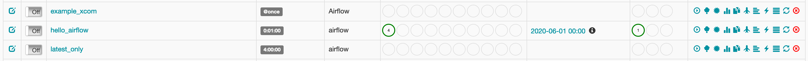

# Airflow Tutorial

## Setup

### gitignore ファイルの生成
```shell
# gitignore.io から Python の gitignore ファイルを生成する
% curl -L http://www.gitignore.io/api/python > .gitignore
```

### Python 仮想環境の作成
[Python Docs : 仮想環境の作成](https://docs.python.org/ja/3/library/venv.html)を参考に Python の仮想環境を作成する。

#### 1. pyenv のインストール
このリポジトリ以下で利用する Python のバージョンを取得するために、 [pyenv](https://github.com/pyenv/pyenv) を使用する（インストール方法についてはリンク先を参照する）。

#### 2. Python のバージョンの指定
```shell
# .python-version が作成される
% pyenv local 3.7.5

# 有効になっているバージョンの確認
% python -V
Python 3.7.5
```

#### 3. 仮想環境の初期化
```shell
# .venv という名称のフォルダが作成される
% python -m venv .venv

# 仮想環境を有効にする : fish users
% source .venv/bin/activate.fish
```

### Airflow 開発環境の構築
[Airflow : Home / Installation](https://airflow.apache.org/docs/stable/installation.html) に記載されている手順を参考にローカル開発環境を設定する。

#### OPTIONAL 仮想環境の確認
作成した仮想環境に対する Python のパスが呼び出されていることを確認する。

```shell
# .venv 以下の Python が呼び出されていることを確認する
% which python
path/to/airflow-tutorial/.venv/bin/python
```

#### 1. Airflow のインストール
```shell
% pip install apache-airflow
```

#### 2. データベースの初期化
> Airflow ではタスクを実行する前にデータベースを初期化する必要があります。Airflow で実験を行うあるいは学習しているだけの場合には、デフォルト設定としての SQLite を指定したまま利用することができます。 SQLite を利用したくない場合には、[データベースバックエンドを初期化する](https://airflow.apache.org/docs/stable/howto/initialize-database.html)を参考にその他のデータベースの設定を行ってください。

```shell
# 仮想環境内の Airflow CLI を参照していることを確認
% which airflow

# データベースの初期化 : ユーザホームの airflow ディレクトリに SQLite データベースが作成される
% airflow initdb
DB: sqlite:////Users/msaigusa/airflow/airflow.db
[2020-06-21 19:18:19,607] {db.py:378} INFO - Creating tables
...
...
...
WARNI [airflow.utils.log.logging_mixin.LoggingMixin] cryptography not found - values will not be stored encrypted.
Done.
```

## Your first DAG
Apache Airflow の DAG を Python スクリプトとして記述する。

### OPTIONAL VSCode の設定
VSCode を利用している場合には、次の手順を通じてコード補完の設定を行うと開発が効率的になる。

```shell
% mkdir .vscode
% touch .vscode/settings.json
```

作成した `.vscode/settings.json` を以下のように編集する。

```javascript
{
  // 仮想環境を有効化している状態で `% which python` を実行した結果を貼り付ければ良い
  "python.pythonPath": "path/to/airflow-tutorial/.venv/bin/python"
}
```

### 1. DAG の設定スクリプトの記述
```shell
% mkdir -p airflow/workflows
% touch airflow/workflows/hello_airflow.py

# airflow/workflows/hello_airflow.py の内容を記述する
```

### 2. シンタックスエラーの検出
作成したスクリプトを実行することで、パイプラインの設定が間違っていないことを確認できる。

```shell
# Airflow のエコシステムを通じて実行している訳ではないので、何も起こらない
% python airflow/workflows/hello_airflow.py
```

### 3. CLI を利用した検証
```shell
# `hello_airflow` という名称の DAG が利用可能であることを確認する
% airflow list_dags --subdir ./airflow/workflows | grep hello_airflow
hello_airflow

# `hello_airflow` パイプラインに含まれるタスク一覧を表示する
% airflow list_tasks --subdir ./airflow/workflows hello_airflow

# DAG 内部のタスクの階層構造を表示する
% airflow list_tasks --subdir ./airflow/workflows hello_airflow --tree
```

### 4. タスクの検証
タスク間の依存関係を無視して、各タスクの動作検証を行う。

```shell
# 以下のような出力が出れば OK
% airflow test --subdir ./airflow/workflows hello_airflow print_date 2020-06-01
[2020-06-21 20:05:11,189] {bash_operator.py:126} INFO - 2020年 6月21日 日曜日 20時05分11秒 JST

% airflow test --subdir ./airflow/workflows hello_airflow sleep 2020-06-01
# 5 秒待機させられる

% airflow test --subdir ./airflow/workflows hello_airflow python 2020-06-01
# `Hello, world!` の文字列が表示される
```

### 5. DAG の実行
```shell
% airflow backfill --subdir ./airflow/workflows -s -1 hello_airflow

# 定義した DAG パイプラインをスケジューラから参照する
% airflow scheduler --subdir ./airflow/workflows

# Web UI から DAG を確認する
# localhost:8080 から確認できる
% airflow webserver
```


